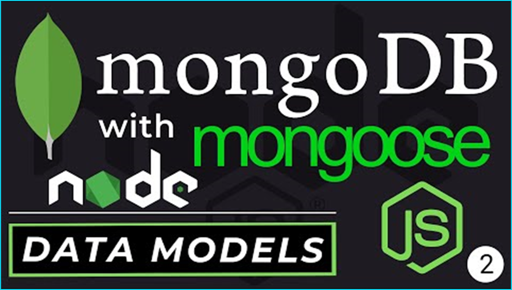

# mongo-api
## Server-side Router with Node.js, Express.js, MongoDB, Mongoose and Insomnia
     

[](https://opensource.org/licenses/MIT) 

<p align="left">
    
    
    
    
</p>
    
<p align="left">
    <a href="https://gist.github.com/Julien-Marcou/156b19aea4704e1d2f48adafc6e2acbf"></a>
    <a href="https://nodejs.org/en"></a>
    <a href="https://docs.npmjs.com/about-npm#getting-started"></a>
    <a href="https://www.npmjs.com/package/json5"></a>
</p>

<p align="left">
    <a href="https://twitter.com/stanpopovic"></a>
    <a href="https://www.youtube.com/@strahinja-popovic-ch"></a>
</p>

## Router server-side application with `Node.js v22.0.0`, `NPM-v10.5.1`, `Express.js-v4.19.2`, `MongoDB-v6.8.0`, `Mongoose-v8.5.0`, and `Insomnia-v9.3.2`

<a id="table-of-content"></a>
## Table of Content

- [Description Info](#description-info)
- [GitHub Repository](#github-repository)
- [Installation Process](#installation-process)
- [Usage Info](#usage-info)
- [Contributing Guidelines](#contributing-guidelines)
- [Test Instructions](#test-instructions)
- [Demonstration on YouTube](#demonstration-on-youtube)
- [License](#license)
- [Questions and Contacts](#questions-and-contacts)

<a id="description-info"></a>
## Description Info

### Mongo API Router uses NPM packages like MongoDB package as a database document model and Mongoose as a object-oriented programming library that establishes connection between database and Node RTE. Mongoose Shemas, database Models and connection are set at first. Seeds for populating databse with testing data at second and routes and controllers at the end. Testing is performed by using Insomnia Client API platform. 

[](./images/mongo-insomnia-bord.PNG)

<a id="github-repository"></a>
## GitHub Repository 
[](https://github.com/strahinjapopovic/mongo-api)

<a id="installation-process"></a>
## Installation Process
### As MongoDB will be used as a document database model it should be installed at first [MongoDB Installation Package](https://www.mongodb.com/try/download/community-kubernetes-operator). Click on the button download and start downloading MongoDB Windows installation package (`mongodb-windows-x86_64-7.0.12-signed.msi`). Also, before start make a empty dir on `C` drive (`C:>mkdir -p data/db`). Start MongoDB Setup Wizard and follow instructions. Setup type should be `Complete`, not Custom, Configuration as `Run service as Network Service user`, also install MongoDB Compass, press `next` and `install`. 

### Configurate MongoDB on Windows
Navigate to the bin directory of already instolled MongoDb on your machine and copy path (`C:\Program Files\MongoDB\Server\6.0\bin`) and go to Edit The System Environment Variables (System Properties) at your PC. After went to `Environment Variables` section, click on the `Path` at User Variables window and press `Edit` button. Click on button `New` and past previously copied path to MongoDB bin directory and press `Ok`. Check your MongoDB is working type in Git Bash terminal as follows (`C:/Users/jdoe> $ mongod`): 

```bash
$ mongod
```
If terminal shows something like image below it means MongoDB is set properly. Othrewise repeat process again.

[](./images/mongo-install-bord.PNG)

After MongoDB is setup, npm packages should be installed at root dir of the application (`~/mongo-api/app>`):
To initialize package.json and to install node_packages run
```bash
$ npm init # initialize formating of package.json
$ npm install # installing node packages
```

To install mongodb npm packages run
```bash
$ npm install mongodb 
```

To install mongoose npm packages run
```bash
$ npm install mongoose
```

### Populate database with testing data
Seed data are stored in `seed.js` file (`~/utils/seed.js`) and you can execute it as follows:
```bash
$ node ./utils/seed.js
```
Alternatively,
```bash
$ npm run seed # automate executable shortcuts scripts at package.json
```
### Run seed output:
[](./images/mongo-seed-bord.PNG)

<a id="usage-info"></a>
## Usage Info

As a small application it can be helpful for testing and practising purpose but on the other side it has some atributes of serious programming application.

<a id="contributing-guidelines"></a>
## Contributing Guidelines

Currentlly, at this stage there is no contributors but for more information any enquiry can be reffered to Question and Contact section.

<a id="test-instructions"></a>
## Test Instructions

Application runs by invoking command `$ npm run start` at `~/mongo-api/app>` directory. Before running application, download compressed repo from githaub and installl packages globaly or at application root directory from the section [Installation Process](#installation-process). 

```bash
$ nodemon ./server.js # OR node ./server.js 
```

Alternatively,
```bash
$ npm run dev
```

All automate executable scripts are stored at root directory `~/mongo-api/app>` in `package.json` file.
```json
"scripts": {
    "test": "jest",
    "start": "node ./server.js",
    "dev": "nodemon ./server.js",
    "seed": "node ./utils/seed.js"
  },
```

<a id="demonstration-on-youtube"></a>
## Demonstration on [YouTube](https://youtu.be/lEoGeMcE5zM)

Demonstration of the application can be visited below.

[](https://youtu.be/lEoGeMcE5zM)

## License

Copyright © 2024, [codexdev](https://github.com/strahinjapopovic). Released under the [MIT License](./LICENSE).

<a id="questions-and-contacts"></a>
## Questions and Contacts

Questions about application can be reffered to the author's [GitHub account](https://github.com/strahinjapopovic) or you can [Contact Me](mailto:spope.mails@gmail.com) directly over an email.
